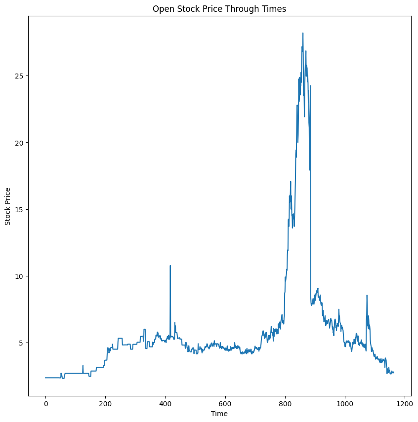
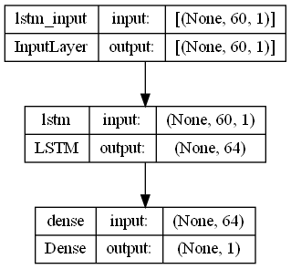
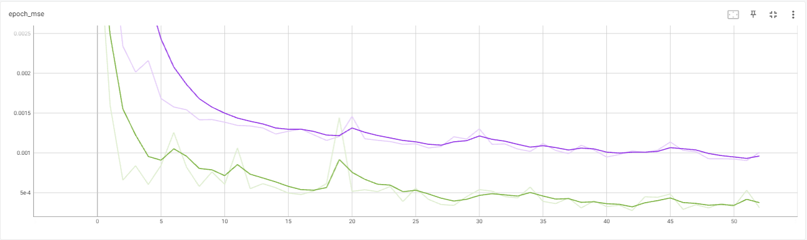
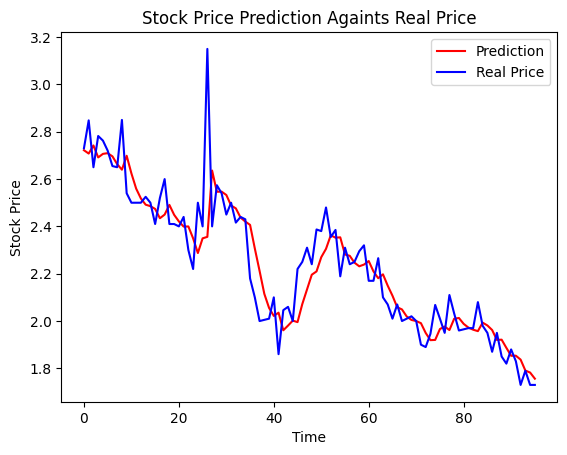

# Predicting Top Glove Stock Prize With A RNN Model
A project made to predict Top Glove stock price using a deep learning model. A dataset of Top Glove stock price from March 2017 until October 2021 is used to train the model and a dataset of the stock price from October 2021 until March 2022 is used to test the model. The prediction is evaluate with Mean Absolute Error (MAE) and Mean Absolute Percentage Error (MAPE) metrics and the model managed to score a 3.6% error value on MAPE.

The model used in the project is the LSTM and the detailed steps taken in processing the data and building the model is detailed in the sections [below](#steps-taken). Some visualization of the data and model used is also shown in the [Visualization](#visualization) section below along with a graph of the prediction produced by the model againts the true values from the test data.

## Steps Taken
### Step 1 - Data loading    
### Step 2 - Data inspection    
### Step 3 - Data cleaning    
### Step 4 - Features selection   
### Step 5 - Data pre-preprocessing    
### Step 6 - Model development    
### Step 7 - Model analysis  

## Visualization

  

  

Graph of open stock price after the duplicated data had been filled with interpolation.

 

  

  

The structure of the model used for the prediction which consists of one layer of LSTM with 64 nodes.

 

  

  

Graph of the training progress along with the validation for each epoch with the purple line being the error value for training and green for validation.

 

  

  

The prediction made by the model againts the true values from the test data which managed to score a 3.6% in MAPE value.

